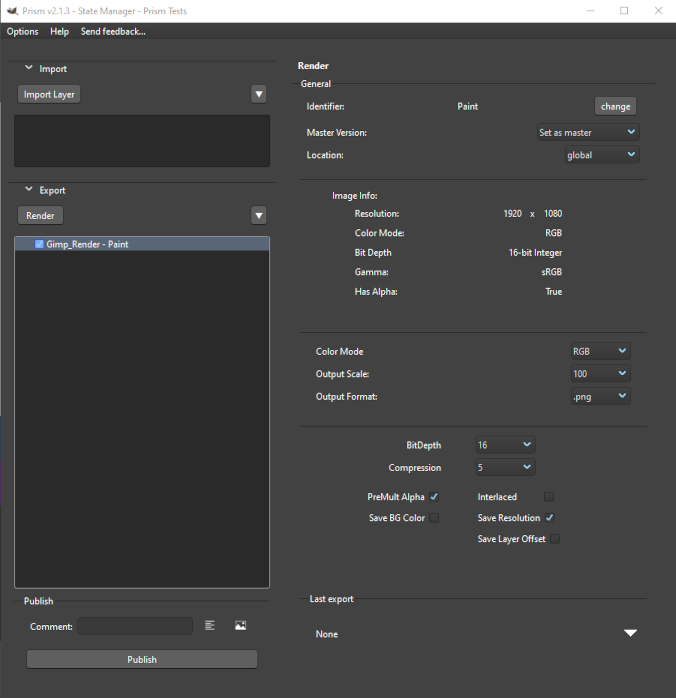

# **Exporting**

Exporting images from GIMP into the Prism project structure is done through the **Gimp_Render** state in the Prism State Manager.  Open the State Manager via **Prism -> 4 - Open State Manager**, then add a new Gimp_Render state from the Render section.

 

## **Image Specs**

The top of the Gimp_Render state displays the current image's details, read live from GIMP:

- **Resolution:** Width × Height in pixels.
- **Color Mode:** RGB or Grayscale.
- **Bit Depth:** The image precision (e.g. 8-bit Integer, 16-bit Integer, 32-bit Float, 16-bit Half Float).
- **Gamma:** Linear or sRGB, derived from the image precision setting in GIMP.

These are read-only and reflect the active image.  They update when the State Manager is opened.

 

## **Output Format**

Select the desired output format from the **Format** dropdown.  Supported formats are:

| Format | Notes |
|--------|-------|
| `.png` | Lossless.  Supports alpha (RGBA/GRAYA). |
| `.exr` | OpenEXR.  Supports alpha and high bit-depth. |
| `.jpg` | Lossy.  No alpha. |
| `.tif` | TIFF.  Supports alpha. |
| `.pdf` | PDF document export. |
| `.psd` | Photoshop format (see **PSD as Scenefile** below). |

Each format exposes its own format-specific settings panel below the format selector.

 

## **Color Mode Override**

An optional **Color Mode** override allows exporting the image in a different color mode than the source:

- **RGB / RGBA** — Standard color export.
- **Gray / GrayA** — Grayscale export.

The conversion is applied to a duplicate of the image and does not alter the original scenefile.

 

## **Scale**

An optional **Scale** percentage allows down-scaling (or up-scaling) the exported image without modifying the original.  Available options: 10%, 25%, 50%, 100%, 150%, 200%, 300%.

The default is 100% (no scaling).

 

## **Format-Specific Settings**

### PNG
- **Bit Depth:** Export bit depth (may differ from the source image precision).
- **Compression:** Lossless compression level 1–10 (higher = smaller file, slower).
- **PreMult Alpha:** Enables pre-multiplied alpha for the exported PNG.
- **Interlaced:** Enables interlaced PNG encoding.
- **Save Background Color:** Saves a background color chunk.
- **Save Resolution:** Embeds DPI/PPI metadata.
- **Save Layer Offset:** Saves layer offset data.

### EXR
> [!NOTE]
> There are no available options for the EXR export at this time as Gimps's exporter does not expose any options.  The exported EXR will take the current image's settings and encode as below:

- **Compression:** Gimp encodes all EXR exports to lossless ZIP compression.
- **Alpha"** The exported EXR will be RGB or RGBA based on if the image has an Alpha Channel.
- **Bit Depth:** The exported EXR will be Float 16 unless the Gimp image 'Encoding' is set to Float 32.

### JPEG
- **Quality:** Compression quality 0–100 (lower = more compression/loss).
- **Smoothing:** Pre-export smoothing level.
- **Subsampling:** Chroma subsampling mode (4:2:0, 4:2:2, 4:4:4, etc.).
- **Optimize:** Enables Huffman table optimization.
- **Progressive:** Enables progressive JPEG encoding.
- **Baseline JPEG:** Forces baseline-compatible encoding.

### TIFF
- **Compression:** Compression codec (None, LZW, Deflate, PackBits, etc.).
- **Save Layers:** Saves all GIMP layers as separate TIFF layers.
- **Save BIGTIFF:** Saves to the BIGTIFF format (64bit) to allow greater than 4gb files.
- **Save Transparent Color:** Saves the color of completely transparent pixels.

### PDF
- **Omit Hidden Layers:** Skips layers that are currently hidden in GIMP.
- **Apply Layer Masks:** Merges Gimp layer masks to PDF layers.
- **Bitmaps to Vector:** Convert images to vector shapes if possible.

 

## **PSD as Scenefile**

When exporting to `.psd`, an additional option is available to save the `.psd` as a **Scenefile** rather than into the standard Media/Renders identifier.  This exports the `.psd` alongside the `.xcf` source file, using the same version number, under the Scenefiles tab of the project.

 

## **Dev Notes**

### Non-Destructive Export

All color mode conversions and scaling are performed on a full duplicate of the GIMP image before export.  The original image in GIMP is never modified by a Render state publish.

### Export Procedure

The bridge selects the appropriate GIMP PDB export procedure for each format (e.g. `file-png-save`, `file-jpeg-save`, `file-tiff-save`) based on the format map in `GimpMapping.py`.  It tries the primary procedure and falls back to alternatives for cross-version compatibility with different GIMP 3 builds.

 

___
jump to:

[**Installation**](Installation.md)

[**Interface**](Interface.md)

[**Importing**](Importing.md)
