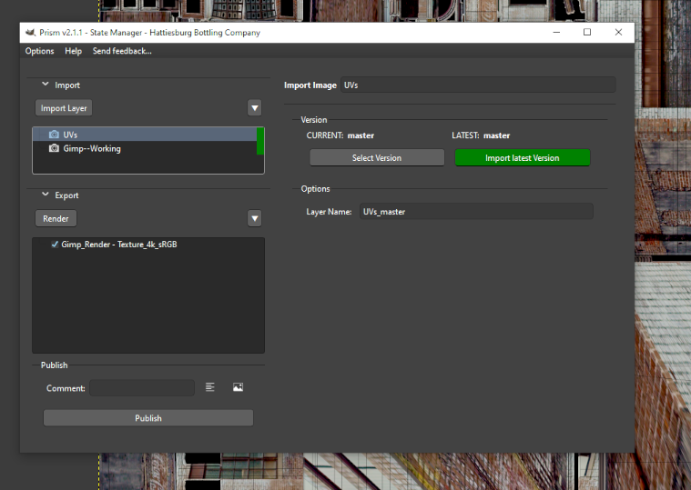
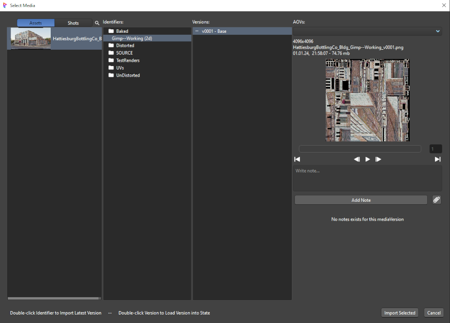

# **Importing**

Images can be added to the Gimp image in the normal ways (import, drag/drop, etc), but the integration adds the ability to import images from the Prism project structure directly into GIMP.  This is done through the **Gimp Import** state in the Prism State Manager.  Open the State Manager via **Prism -> 4 - Open State Manager**, then click the **Import Layer** button in the Imports section.



<br/>

## **Selecting Media**

When a new Gimp Import state is created, the Prism **Media Browser** opens automatically to allow you to select the source image.



- **Double-click an Identifier:** Imports the latest version of that media identifier.
- **Double-click a Version:** Imports the specific selected version.

The selected image is loaded from disk and inserted as a new layer into the currently active GIMP image.

<br/>

## **Layer Naming**

When the image is imported, the new layer is automatically named using the pattern:

```
{identifier}_{version}
```

for example: `beauty_v003`

When an image-layer version is changed using the State Manager popup, the plugin attempts to update its name to reflect the version.  This means if the layer name has the version as a suffix (by default) it will rename the layer using the new version suffix.

for example: `beauty_v003` -> `beauty_v004`

The layer name can be edited at any time using the **Layer Name** field in the state.  Any change made in the state is reflected immediately in GIMP, and renaming the layer directly in GIMP's Layers panel is also detected and reflected back in the state.

> [!NOTE]
> This layer name handling only works for images imported into Gimp using an Import State.  Manually added images will not be updated or tracked by Prism.

<br/>

## **State Functions**

- **Browse / Select Version:** Opens the Media Browser to allow selecting a different version of the media.  Use this to compare versions or to manually upgrade/downgrade.

- **Import Latest Version:** Re-imports the highest available version of the media without opening the browser, replacing the existing layer.

> [!NOTE]
> The **Import Latest Version** button will highlight in orange when a newer version is available than the one currently imported, as a visual reminder to update.

<br/>

## **Layer Tracking**

Each import state tracks its imported layer using GIMP's persistent layer **tattoo** (a Gimp internal ID).  This means:

- Renaming or moving the layer in GIMP will not break the state's link to it.
- When State Manager states are saved into the `.xcf` file (via parasites), the tattoo is preserved and the layer is correctly re-linked when the file is re-opened.

<br/>


## **Dev Notes**

### Layer Import Mechanism

The bridge uses `gimp-file-load-layer` (or its fallback `file-open-as-layer`) to load the source image file as a layer object, then inserts it at the top of the layer stack in the active image.  The layer tattoo is read immediately after insertion and stored in the state data so it can be used for all subsequent operations (rename, replace, delete).

### Replace vs. Re-import

When **Import Latest Version** is triggered, the integration does not delete and re-insert the layer — it replaces the layer's pixel content in-place using `gimp-layer-resize` and pixel copy operations.  This preserves the layer position within the stack and avoids disrupting blend modes or masks that a user may have applied on top.

<br/>

___
jump to:

[**Installation**](Installation.md)

[**Interface**](Interface.md)

[**Exporting**](Exporting.md)
