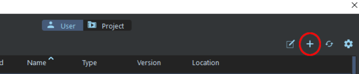
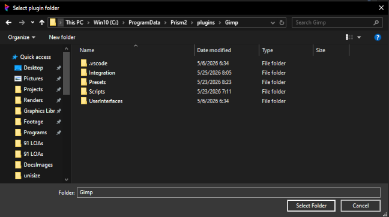
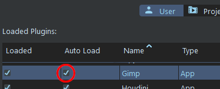
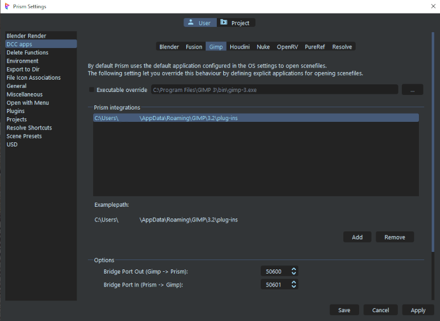

# **Installation**

Copy the directory named "Gimp" to a directory of your choice, or a Prism2 plugin directory.

It is suggested to have the Gimp plugin with the other DCC plugins in: *{drive}\ProgramData\Prism2\plugins*

Prism's default plugin directories are: *{installation path}\Plugins\Apps* and *{installation Path}\Plugins\Custom*.

You can add additional plugin search paths in Prism Settings.  Go to Settings -> Plugins and click the gear icon.  This opens a dialogue where you may add additional search paths at the bottom.

Once added, select the "Add existing plugin" (plus icon) and navigate to where you saved the Gimp folder.

 

 

Afterwards, you can select the Plugin autoload as desired:

 

To add the integration, go to "DCC Apps" -> "Gimp" tab.  Then click the "Add" button and navigate to the folder containing the GIMP 3 executable (e.g. `gimp-3.0.exe` on Windows).

 

___
jump to:

[**Interface**](Interface.md)

[**Importing**](Importing.md)

[**Exporting**](Exporting.md)
