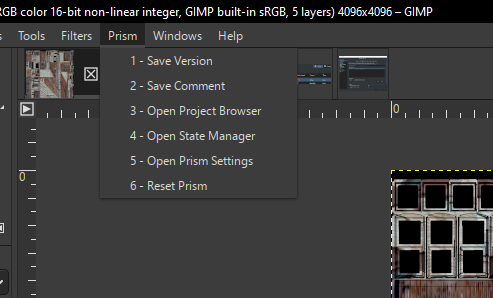
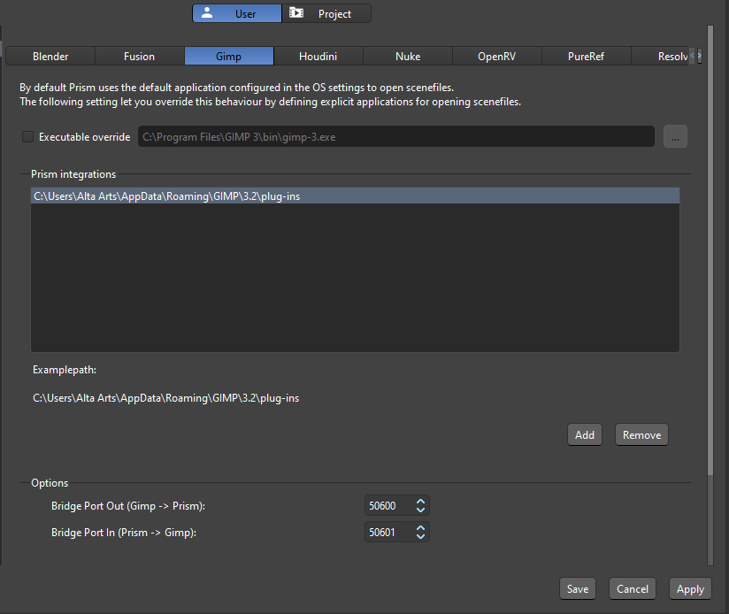

# **Interface**

## **Prism Menu**

 

Prism functions are accessed through the **Prism** menu in the top menu bar of GIMP's UI.  The menu items look familiar to Prism users and contain the standard Prism functions.

- **1 - Save Version:** Captures a thumbnail from the current GIMP image and saves a new incremented version into the Prism project structure.

- **2 - Save Comment:** Opens a dialogue to enter a comment and/or description for the new version, and optionally choose a custom thumbnail image.  Then saves a new version as above.

- **3 - Open Project Browser:** Launches the Prism Project Browser.

- **4 - Open State Manager:** Launches the Prism State Manager.  This allows importing images as layers (see [**Importing**](Importing.md)) and exporting the current image to various formats (see [**Exporting**](Exporting.md)) into the Prism project structure.

- **5 - Open Prism Settings:** Launches the Prism Settings window.

- **6 - Reset Prism:** Restarts the external Prism host process.  Use this if Prism becomes unresponsive while GIMP is open.

 

## **Settings**

The GIMP plugin has configurable settings in the Prism Settings window under **Settings -> DCC Apps -> Gimp**.

 

- **Bridge Port Out (Gimp -> Prism):** The localhost port used for commands sent _from_ GIMP _to_ the Prism host process.  Default: `50600`.

- **Bridge Port In (Prism -> Gimp):** The localhost port used for commands sent _from_ the Prism host _to_ the GIMP bridge.  Default: `50601`.

> [!NOTE]
> There is usually no need to change either port unless another process on the machine is already using them and causing conflicts.  Both ports must be available and permitted by any firewall or antivirus software.

 

## **Dev Notes**

### Architecture

GIMP 3 supports Python plugins (via PyGObject/`gi`) in addition to Script-Fu.  This integration uses Python inside GIMP for plugin registration and GIMP API access.  Prism itself runs in a separate process so the PrismCore/Qt runtime stays isolated from GIMP's process and event loop.  The GIMP 3 integration runs as a bridge between **three active runtime contexts**:

1. **GIMP Plugin Runtime (`Prism_Gimp.py`)**
Runs inside GIMP's embedded Python (`gi`/GLib).  This is where plugin procedures are registered and menu actions are routed.

2. **In-GIMP Bridge Service (`Prism_Gimp.py`)**
Started as a **persistent** procedure (`extension-prism-gimp-bridge`).  It remains active for the full GIMP session, listens on localhost sockets, and dispatches bridge work through the GLib event loop.

3. **External Prism Host (`Prism_Host.py`)**
Launched as a separate subprocess using Prism's Python + Qt stack (`QApplication`, `PrismCore`).  This isolates Qt/Prism UI and core logic from GIMP's process.

All communication is local-only over `127.0.0.1`.

#### Startup Process Cycle

1. GIMP executes `Prism_Gimp.py`, which initializes `PrismGimpBridgeRuntime` and reads integration settings (including bridge ports).
2. GIMP calls procedure discovery/creation (`do_query_procedures`, `do_create_procedure`).
3. The persistent bridge procedure is auto-started by GIMP.
4. The bridge opens its server socket and marks itself persistent-ready.
5. The bridge ensures Prism Host is running; if not, it launches `Prism_Host.py` as a separate process.
6. Prism Host writes its PID to `Prism_Gimp_Settings.json`, starts Qt event processing, and begins monitoring the configured parent PID for auto-shutdown (when parent monitoring is enabled).

#### Command Flow

When the user triggers a Prism menu action:

1. `runPrismCommand()` in `Prism_Gimp.py` maps the menu action to a command name.
2. The runtime sends a JSON command over localhost to **Bridge Port Out**.
3. The Prism Host command server (in `Prism_Host.py`) receives that command and dispatches it on the Qt event thread.
4. Host actions that require direct GIMP API work call back into the in-GIMP bridge on **Bridge Port In**.
5. The in-GIMP bridge executes those GIMP actions on the GLib main loop (`GLib.idle_add()`) and returns JSON responses.

#### Port Roles

- **Bridge Port Out**: listened to by Prism Host command server; used when GIMP runtime sends Prism menu commands.
- **Bridge Port In**: listened to by in-GIMP bridge service; used when Prism Host/plugin code sends GIMP action requests.

The `in`/`out` naming is from the bridge service perspective.

#### Core Python objects

Key objects involved in this architecture:

- **`PrismGimpBridgeServiceRuntime`** (in `Prism_Gimp.py`):
	Shared bridge-side state and helpers (settings, rotating log access, image-id hint state).

- **`PrismGimpBridgeRuntime`** (in `Prism_Gimp.py`):
	Main GIMP plugin runtime.  Registers procedures, launches/monitors host lifecycle, and routes menu actions.

- **`PrismGimpBridgeService`** (in `Prism_Gimp.py`):
	Persistent in-GIMP socket service created by `runPrismBridge()`.  Receives bridge actions and executes them on the GLib main loop.

- **`PrismHostRuntime`** (in `Prism_Host.py`):
	External host runtime.  Sets up Prism Python/Qt environment, starts host command socket server, writes host pid state, and runs Qt event loop.

- **`PrismToolsWindow`** (in `Prism_Host.py`):
	Host-side Prism container object.  Owns command dispatcher, maps Prism actions, and starts parent-process monitor timer.

- **`Prism_Gimp_Functions`** (in `Scripts/Prism_Gimp_Functions.py`):
	Prism-side GIMP plugin API implementation loaded by PrismCore inside the host process.  Called by `PrismToolsWindow` when GIMP menu commands are dispatched from the bridge, and invoked by PrismCore for lifecycle callbacks.

 

### State Manager State Storage

Prism State Manager state data is stored directly in the `.xcf` scenefile using GIMP's [parasites](https://developer.gimp.org/core/specifications/parasites/) mechanism.  This means State Manager states are embedded in the scenefile and persist across sessions with no external sidecar files needed.
