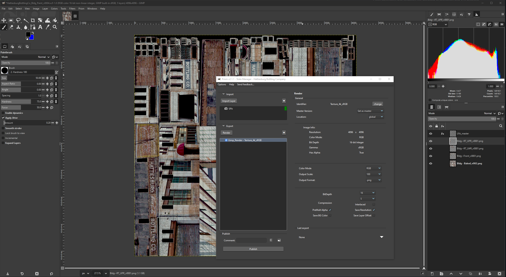

#  **Gimp 3 Integration for Prism Pipeline 2**

A GIMP 3 integration to be used with version 2 of Prism Pipeline

Prism automates and simplifies the workflow of animation and VFX projects.

You can find more information on the website:

https://prism-pipeline.com/

 

 

## **Notes**

- Requires GIMP 3.0+ and Prism 2.x (Python 3.11+).

- Supported export formats: `.png`, `.exr`, `.jpg`, `.tif`, `.pdf`, `.psd`.
- Tooltips are provided throughout the UI.

 

## **Installation**

- You can either download the latest stable release version from: [Latest Release](https://github.com/AltaArts/Gimp_Integration--Prism-Plugin/releases/latest)

- Or download the current code zipfile from the green "Code" button above or on [Github](https://github.com/AltaArts/Gimp_Integration--Prism-Plugin)

 

[**Installation Instructions**](Docs/Installation.md)

 

## **Documentation**

[**Interface**](Docs/Interface.md)

[**Importing**](Docs/Importing.md)

[**Exporting**](Docs/Exporting.md)

 

## **Issues / Suggestions**

For any bug reports or suggestions, please add to the GitHub repo "Issues" or "Projects" tabs.
